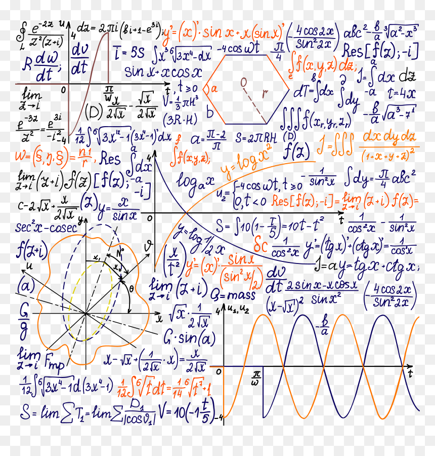

# Math 

В данном проекте представлена реализация некоторых функций стандартной библиотеки <math.h>. Большинство реализовано с помощью рядов тейлора и метода наименьших квадратов. Выбран баланс относительно точности получаемых значений и скоростью работы функций.

## Содержание библиотеки

 1) `long double my_sin(double x)` - возвращает sin(x).
 2) `long double my_cos(double x)` - возвращает cos(x).
 3) `long double my_tan(double x)` - возвращает tan(x).
 4) `long int my_abs(int abs)`  - возвращает |x| для long int.
 5) `long double my_fabs(double x)` - возвращает |x| для long double.
 6) `long double my_atan(double x)` - возвращает atan(x).
 7) `long double my_asin(double x)` - возвращает asin(x).
 8) `long double my_acos(double x)` - возвращает acos(x).
 9) `long double my_floor(double x)` - возвращает ближайшее целое число <= x.
 10) `long double my_sqrt(double x)` - возвращает квадратный корень x.
 11) `long double my_log(double x)` - возвращает ln(x).
 12) `long double my_pow(double x, double y)` - возвращает x^y.
 13) `long double my_ceil(double x)` - возвращает ближайшее целое число больше x.
 14) `long double my_fmod(double x, double y)` - возвращает остаток от деления x на y.
 15) `long double my_exp(double x)` - возвращает e^x.

Дополнительно заданы распространённые константы для вычислений, таки как ln2, pi/2, pi и т.д.

Все исходные файлы и makefile находятся в папке src. Сборка осуществляется при помощи gcc вресии 9.4.0 при помощи makefile на Linux.